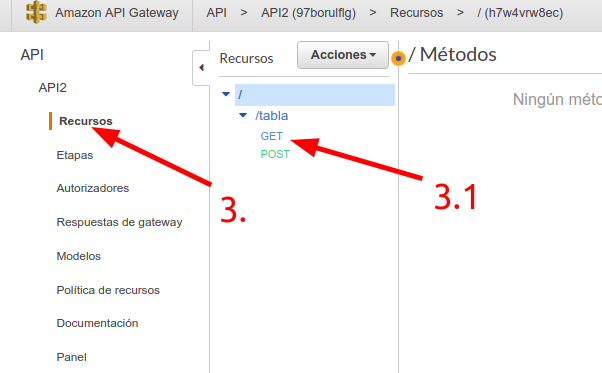
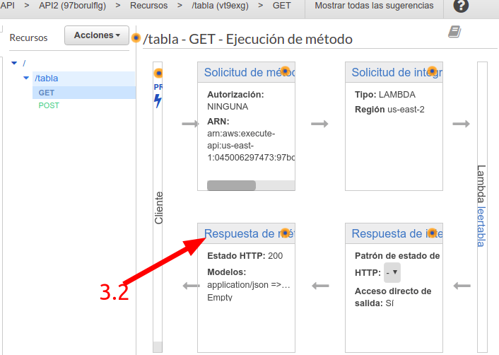
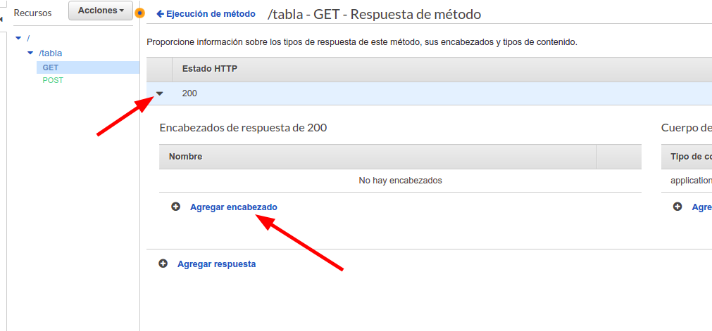
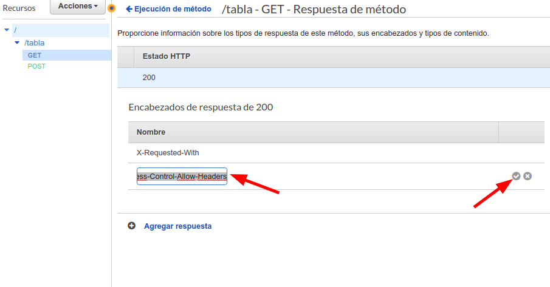
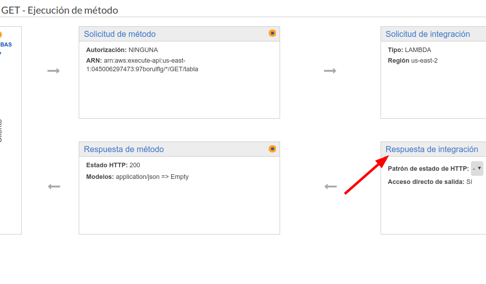
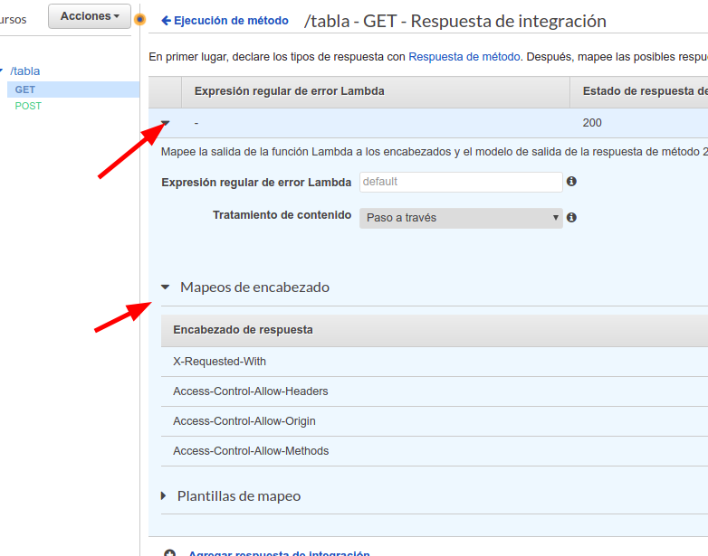
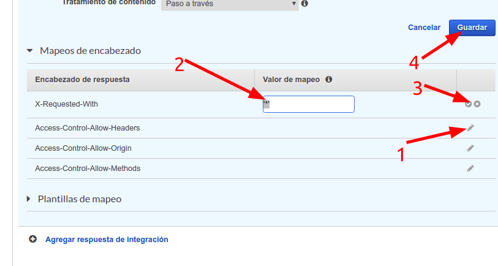
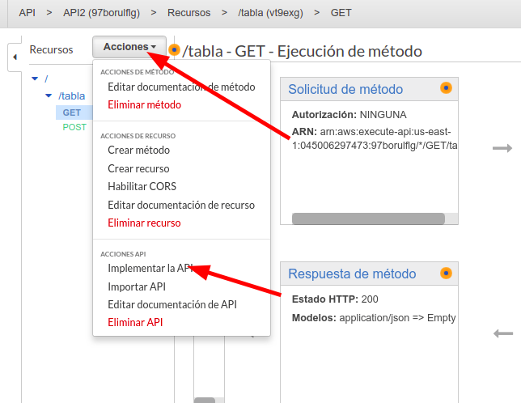

# reactjsConsumeREST

## API GETWAY Configuration

### API Methods configuration to enabled CORS Headers

1. Go to console menu from AWS
2. Click on  API GATEWAY Link
3. Select reourses tab in the left panel
    1. Select a method to assigne the headers access

    
    2. In the right opened panel, choose ***Respuesta de Método***
    
    * Expand the *200* option from the ***Estado HTTP***
        * Click on ***Agregar encabezado***
            
            * You need to add the next headers now.:
                * `X-Requested-With`
                * `Access-Control-Allow-Headers`
                * `Access-Control-Allow-Origin`
                * `Access-Control-Allow-Methods`

    
    3. In the right panel, choose ***Respuestas de Integración***
        

    * Expand the *row with status 200*
        * Expand ***Mapeos de encabezado***
        

        * Add the mapping value (***Valor de mapeo***) to all options like that and save changes:

        Encabezado de Respuesta       |    Valor de mapeo
        --------------------------    |---------------------------
        X-Requested-With              | '*'
        Access-Control-Allow-Headers  | 'Content-Type,x-requested-with,Access-Control-Allow-Origin,Access-Control-Allow-Headers,Access-Control-Allow-Methods'
        Access-Control-Allow-Origin   | '*'
        Access-Control-Allow-Methods  | 'POST, GET, OPTIONS'

    
    4. Finally, Deploy again the API
    